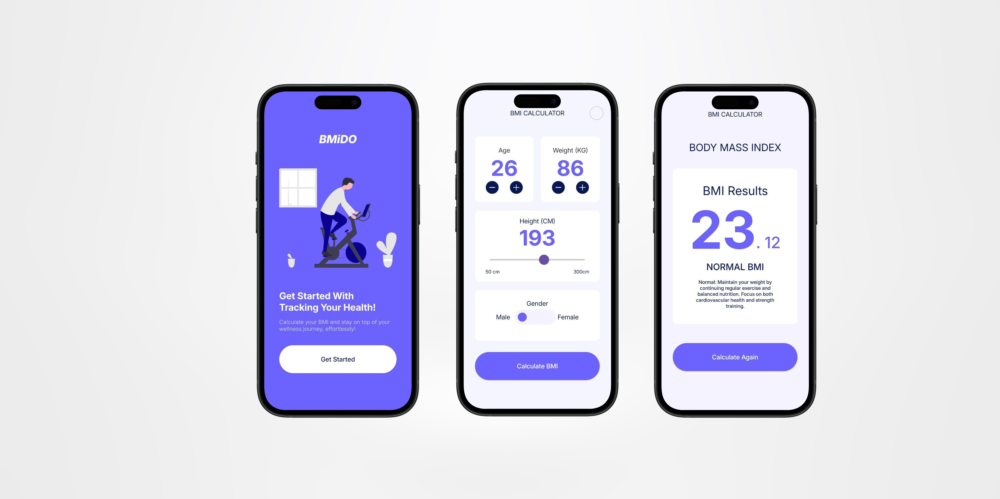

# BMiDO

## Overview
This is a simple BMI calculator that can track the user's BMI and could give the user some tips about the range he/she is in with simply giving their age, height and weight. The app has been written with kotlin language and jetpack compose framework.

## Technologies Used
 - Language: Kotlin

## PRoject Setup
To run the application:

 1. Clone the repository.
 2. Open the project in Android Studio.
 3. Build and run the app on an Android emulator or physical device by your choice.
